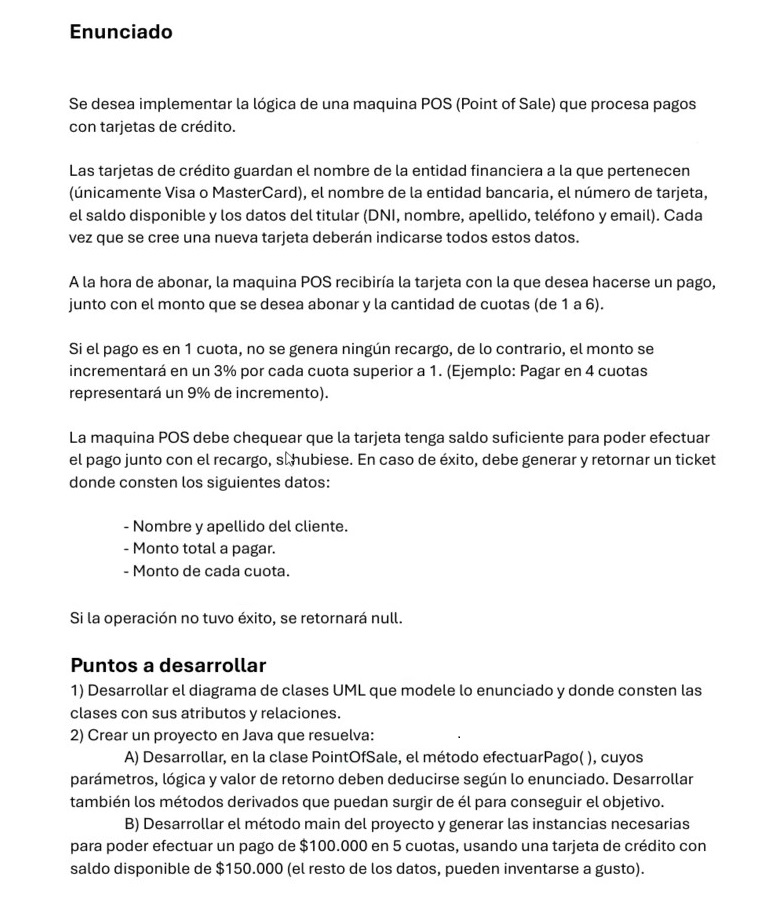
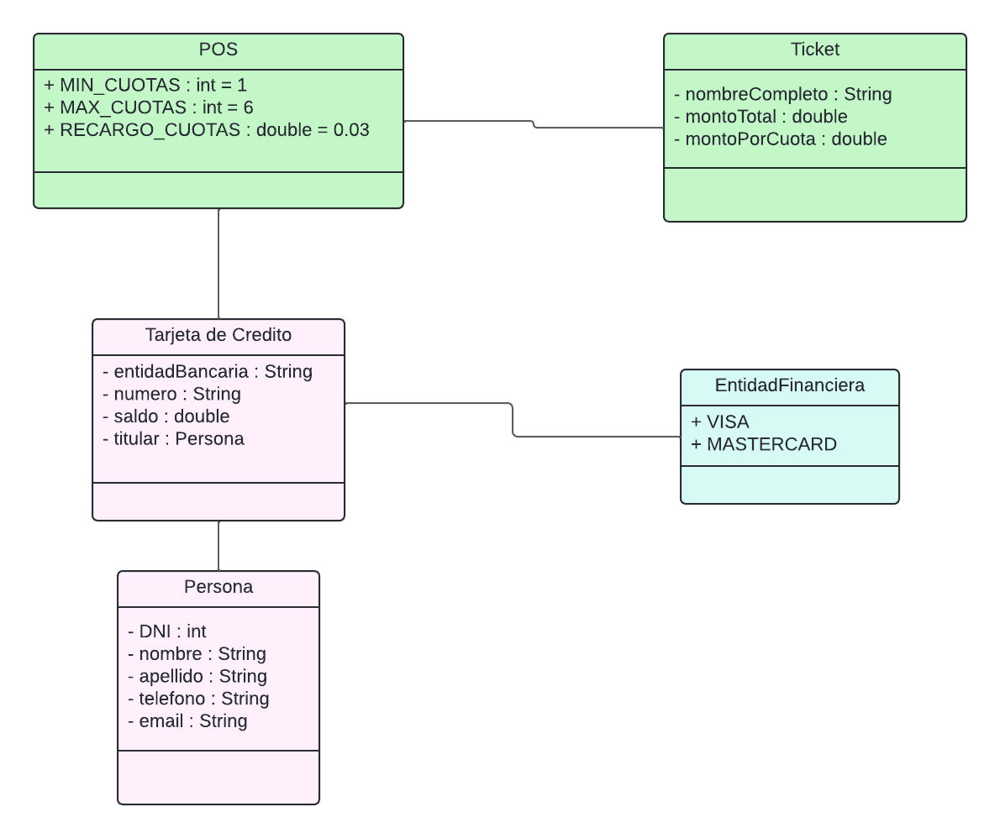
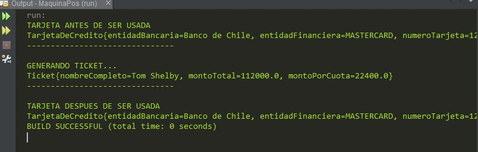

**_<h1 align="center">:vulcan_salute: Ejercicio En Clase Máquina POS:computer:</h1>_**
**_<h2 align="center">Módulo 2 - Fundamentos de Programación en Java</h2>_**

- Máquina POS - con requerimiento se estructura diagrama y luego se desarrolla la aplicación:

